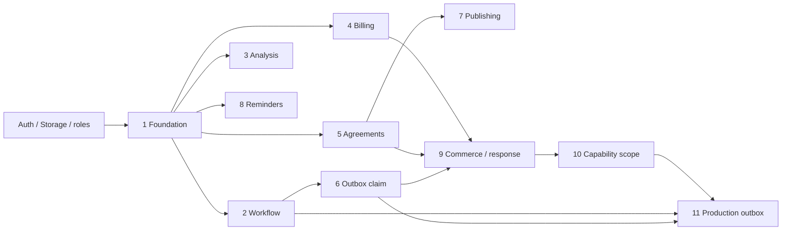

# BuyerMatch Production migration reconciliation

**PRODUCTION MIGRATION PLAN VERIFIED — strategy A, existing eleven-source chain unchanged.**

Audit date: October 3, 2026. Starting commit: `2b1d71c9f8fa397654475834e0ca80b5ce412c8a`. This is database migration-plan verification, not application release approval. Production remains unchanged: no migration, history repair, deployment, configuration change, customer-row write or invitation send. No bridge is necessary for the inspected state.

## Evidence and recovered history

Production `aigvnbxiydbzzqbetlhl` has 42 migration identities: 29 shared legacy identities and 13 additional legacy migrations. All ten baseline BuyerMatch migrations and the eleventh outbox migration remain absent. Historical source-file checksums are unavailable; matching versions is not proof of identical SQL.

Fetching all origin branches/tags recovered all 13 original migration paths in reachable Git history. They must remain in Production history. We inspected stored migration statements and current catalog definitions read-only. Original Git sources are references; we did not rerun historical data backfills or claim their bytes equal the deployed statements.

| Production-only version / name | Recovered source commit | Resulting legacy effects |
|---|---|---|
| 20260729193000 durable_submission_inventory | 260aff4e635e38caef36fa821fdcd0260779bb28 | Inventory deals, submission links, workspace access/conversion RPCs and indexes |
| 20260802221500 submission_workspace_review_rls | 4fcaae353cf6b7f03b349eafe0ad315a7afe104b; earlier ffbcb617995f2251292d8abc60850d6ef1b7ab82 | Submission workspace assignment, index, trigger and workspace policies |
| 20260802233000 backfill_workspace_assigned_converted_inventory | 3084375341b41dd6725d04af93c227e00d42dd51 | Converted inventory data backfill; no new schema |
| 20260802234500 assign_legacy_submission_workspace_and_backfill | 659594d7cfcce2e4094b9be8ec0bf61b2391cfaa | Legacy workspace assignment/backfill; no new schema |
| 20260802235500 resolve_legacy_workspace_from_durable_evidence | a92fb4b1147afe177bf6b8f2914f90e4d6c8490e | Evidence-based workspace data repair; no new schema |
| 20260803000500 backfill_legacy_conversion_metadata_variants | 571f47acf99a657e76bdd4c3a3244ce0dd22d630 | Conversion metadata data backfill; no new schema |
| 20260803013000 credit_email_closing_foundation | 41b11eccdc5cc01b14c9ebcff61aa8f95ad7c9f6 | Credit ledger/purchase RPCs, Stripe receipts, email outbox/events/suppression, verified closings |
| 20260803020000 backfill_active_included_credit_grants | 25d778acc69885982d0b74d610ae008387a98be5 | Included-credit data backfill; no new schema |
| 20260803024500 atomic_admin_credit_adjustments | 1331cd3a8774bd7429796fdfd61c5b5884ecace6 | Atomic administrator credit-adjustment RPC |
| 20260803143000 update_property_intelligence_credit_policy | 774b8162ceb27076647231e1d741b1e197f88b8b | Workspace plan defaults and included-credit RPC revisions |
| 20260803190000 harden_email_outbox_delivery | 1ea8c64a6a3b9d8dff28f6af4f6ab75df82b19e9 | Legacy email lease/retry columns, claim RPC and worker index |
| 20260810123000 list_email_outbox_operations | 80c3bdd1a9180d6d654396ce75b70cb68dcaa8db | Legacy email operations-list RPC |
| 20260815160000 property_intelligence_history_audit | f2176fd1ba93f92d3e6b633eb417a197c07f8596 | Property searches/audit tables and history indexes |

None creates or changes a `bm_*` object. Legacy `email_outbox` is distinct from `bm_outbox`. No equivalent replacement BuyerMatch migration is needed. Exact current columns, indexes, constraints, policies, triggers and RPC mappings are in [the recovered inventory](BUYERMATCH_PRODUCTION_ONLY_MIGRATIONS.json). Those lists describe current resulting objects, not an assertion that every listed column was introduced by that particular migration.

## Resulting-state comparison

Replayed the branch's 29 shared migrations with its documented staging bootstrap and compared 21 resulting tables / 297 columns against live metadata. All shared function definitions match after whitespace normalization; RLS enablement matches. This does not establish historical source checksum equality.

Observed differences, preserved rather than patched:

- Production `buyer_portal_submissions.buyer_data` has no default and has no `updated_at` column. Both branch expectations originate in its reconstructed staging prelude.
- Production `cloud_snapshots.storage_key` defaults to `dealblastpro-v1`. Production uses UUID `id` as primary key plus unique `(user_id,storage_key)`; the branch fresh baseline uses the composite primary key. Owner/storage-key uniqueness still exists.
- Production's newer submission policy requires public-portal status/workspace, and submission-link reads include authorized workspace access. The earlier branch policies differ.
- Twelve additional Production tables are not created by the branch's legacy baseline; the rehearsal preserves all of them, including backup table schemas without their contents.
- **Separate existing security concern:** broad permissive `deal_submissions` policies (`Authenticated can read/update/delete deal submissions`, and `Public can submit deals`) coexist with newer restrictive workspace policies. Permissive policies combine with OR; the narrower policies do not remove the broad grants. These legacy policies were not changed. This concern is outside the additive BuyerMatch schema and should receive a separate legacy-security review before claiming whole-app isolation.

Full differences are in [the schema comparison](BUYERMATCH_LEGACY_SCHEMA_COMPARISON.json). No BuyerMatch SQL relies on those differing public tables. External prerequisites were checked live: `auth.users.id` is non-null UUID with primary key; `storage.buckets.id` is primary key, the five inserted fields exist with compatible types, additional non-null fields have defaults; `gen_random_uuid()` exists. Public-schema CREATE is denied to anon/authenticated. Existing Storage policies are explicitly scoped to other bucket names.

## Dependency graph and ordered migration plan

The following is the exact recommended order. Run only these files in a future separately authorized Production migration run, not the staging bootstrap or legacy migrations.

| Step | Source under `supabase/migrations/` | Main objects / prior requirements |
|---|---|---|
| 1 | `20260930120000_buyermatch_foundation.sql` | Twelve private tables: deals, buyers, imports, entitlements, analyses, events, documents, acceptances, fee policies, exposures, outbox, closings; owner/date and unique indexes, FKs, immutable audit triggers, initial analysis RPC, private bucket. Requires managed Auth/Storage and roles. |
| 2 | `20260930130000_buyermatch_workflow.sql` | Configuration, offers, distribution requests, immutable triggers, queue/progress RPCs; requires step 1. |
| 3 | `20260930140000_buyermatch_analysis_concurrency.sql` | Replaces five-argument analysis RPC with six-argument atomic version; requires step 1. |
| 4 | `20260930150000_buyermatch_billing.sql` | Plans, billing events, entitlement event-order column, billing RPC/audit trigger; requires step 1. |
| 5 | `20260930160000_buyermatch_agreements_imports.sql` | Buyer source ciphertext, acceptance/import RPCs, approved-document immutability trigger; requires step 1. |
| 6 | `20260930170000_buyermatch_outbox_claim.sql` | Outbox lease column and consent/contract-checked claim RPC; requires steps 1–2. |
| 7 | `20260930180000_buyermatch_document_publishing.sql` | Publishing RPC; requires documents from step 1 and preserves step 5's immutability contract. |
| 8 | `20260930190000_buyermatch_reminders.sql` | Private reminders, unique deal/offset, EOC recalculation trigger; requires step 1. |
| 9 | `20261001090000_buyermatch_test_commerce_delivery.sql` | Duplicate reviews, checkouts, response tokens/responses, provider events, buyer synthetic/merge fields, outbox attempt/expiry/test/error fields; checkout/review/response/callback/edit RPCs, replaced claim RPC, fees-disabled constraint. Requires steps 1, 2, 4, 5, 6. |
| 10 | `20261002190115_buyermatch_response_scope.sql` | Immutable capability UUID/environment/actions, scoped response RPC, delegated legacy RPC; requires step 9 and workflow/exposure objects. |
| 11 | `20261003001913_buyermatch_production_outbox.sql` | Disabled Production configuration, lease UUID, private queue/claim/finish/retry RPCs; requires workflow queue, claim/attempt fields, synthetic/merge checks and scoped tokens from steps 2, 6, 9, 10. |

[Machine-readable object deltas and dependencies](BUYERMATCH_MIGRATION_DEPENDENCIES.json) enumerate every column, constraint, index, RPC and trigger created/changed/removed per step, with canonical source hashes. Graph edges include security-contract ordering, not merely filename order. All new tables enable RLS and revoke browser access. No new browser RLS policy is installed.

The outbox migration fails alone because `bm_outbox`, deals/buyers/exposures, distribution requests, scoped response tokens and queue/claim RPCs do not exist in Production. After the prerequisites, the unchanged migration applies successfully. Capability generation still does not imply acceptance: the worker needs an authorized intent, database lease, provider receipt and successful receipt persistence. Stale lease completion fails; retries retain the provider idempotency key. The response receiver still requires accepted outbox state. Synthetic transport remains staging-only; no provider boundary was changed.

## Rehearsal and security evidence

Command: `node scripts/rehearse-buyermatch-production.mjs`.

Environment: the repository's existing PGlite workflow, version 0.5.8 / PostgreSQL 18.3, using captured Production catalog definitions. Production is PostgreSQL 17.6; this is a schema-equivalent rehearsal, not an identical managed-runtime clone. The SQL chain is also exercised by existing clean-baseline tests; hosted staging now contains the whole chain.

Reconstructed 33 public tables, 85 constraints, 84 indexes, 28 application functions, 10 triggers and 80 public/Storage policies. Restored object ACLs and Production-style default grants. Managed Auth/Storage use the minimal required contracts; vault contents, managed event triggers, unrelated extension infrastructure and customer data are not copied. Existing functions are restored with schema-restore function-body checking disabled; BuyerMatch migration creation uses normal validation. The fixture contains metadata only, with two entirely synthetic local legacy rows created by the test.

**11/11 migrations and 188/188 rehearsal assertions pass.** All legacy columns/defaults/nullability, constraints, indexes, function definitions/grants, table RLS/grants, triggers and policies are identical before/after. Synthetic workspace/snapshot rows remain unchanged; owner snapshot access and other-user denial still work. BuyerMatch FKs and indexes create without conflicts. All 24 new tables enforce RLS and deny anon/authenticated direct CRUD; service role retains access. All 21 SECURITY DEFINER RPCs deny browser execution and pin search_path to public. Four other functions are invoker-only triggers, not privileged public RPCs. Browser roles cannot create shadow objects in public. A synthetic private Storage object is not exposed by the existing policies.

Owner/workspace authorization remains enforced by the server and database relationship checks; no service-role secret is needed in frontend code. Existing automated tests cover forged admin flags, cross-owner mutations, private identities, capability scope, leases, terminal states, response replay and provider callbacks. SQL SECURITY DEFINER is not used to relax browser authorization.

PGlite is single-session and does not prove live lock timing or multi-session contention. Existing hosted response concurrency assertions remain separate evidence. Schema preservation is not a comprehensive regression test of every deployed legacy application feature.

## Lock/data risk and controlled future execution

Strategy A requires no historical rewrite and no bridge. Production has no BuyerMatch rows, so UUID-default rewrites/check validation in steps 9–10 operate on newly created empty tables. Step 3 drops only the temporary overload created by step 1, not an existing legacy RPC. Every altered public table is newly created `bm_*`; legacy tables are neither rewritten nor data-backfilled. The private bucket insert is the only managed-schema row addition. It is not an invitation send.

Future run: recheck the Production snapshot/prerequisites and absence of `bm_*` collisions; record source hashes and current migration ledger; apply the eleven exact files above through normal migration transactions with bounded lock/statement timeouts. Stop on any mismatch/failure and inspect the actual committed history; do not mark unapplied files as applied or repair history cosmetically. If each source records one migration, history grows from 42 to 53 truthful entries. Immediately compare legacy schema/grants, new FKs/indexes/RPC grants, private bucket and disabled configuration. Keep application deployment and provider enablement separate.

Table ALTER and FK creation still take locks, including a referenced-table lock on Auth during FK creation; catalog/bucket writes can contend. Empty target tables reduce rewrite risk but do not eliminate operational locking. Do not bundle a blind replay of the 42 legacy migrations or either staging-only source. Preserve all 13 legitimate Production-only entries.

## Verification and hosted changes

- Automated tests: **79/79**, including clean DB migration replay and the Production-schema rehearsal wrapper.
- Fixture Production-mode HTTP assertions: **21/21**, within the automated suite, not live Production requests.
- Rehearsal assertions: **188/188**, within the new wrapper.
- Staging-only outbox migration applied to `qxhhlprentrufobpcgna`; its canonical hash was inserted with its actual SQL transaction. Production delivery config defaults false.
- Full staging setup verification: **42/42 checksums**. Prior 41-source baseline is retained as historical evidence, not rewritten.
- Post-migration authenticated Preview suite: **120/120** on the unchanged application Preview `https://deal-blast-i98ywgs59-housebuyerinv.vercel.app` (`dpl_DgtgMuqvmrmLA8VHfhcRKv6dZQgZ`, application commit `2b1d71c9f8fa397654475834e0ca80b5ce412c8a`).
- TypeScript/build pass; lint has **0 errors / 103 existing warnings**. Existing Vite chunk/import warnings remain.

No application, migration source or provider code changed. No browser rerun is claimed. Production configuration, legal/provider authorization, whole-app compatibility and actual Production smoke tests remain separate release gates. Checkout/success fees remain disabled and staging delivery remains mock. **Production remained unchanged.**
